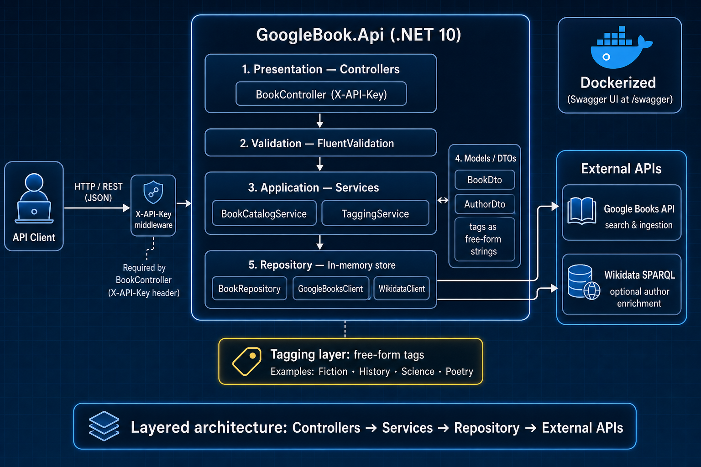

# GoogleBook.Api

**.NET 10** API that talks to [Google Books](https://developers.google.com/books) to search books by text or by a **free-form tag** (`history`, `fiction`, `science`, etc.). Results can optionally be stored in an in-memory catalog, and authors can be enriched via Wikidata.

Tags are not a fixed catalog: `/google/by-tag/{tag}` searches Google Books with `subject:{tag}`; if `autoTag=true`, Google’s own categories are copied as tags.



## Requirements

- .NET 10 SDK
- Docker (optional)
- Google Books API key (optional; without a key you get the public quota)

## Run locally

```bash
dotnet build
dotnet run --project GoogleBook.Api
dotnet test
```

- Swagger: `http://localhost:5142/swagger`
- Health: `GET /health`

`BookController` requires the `X-API-Key` header. In Swagger, click **Authorize** and paste the `GameApi:ApiKey` value.

## Configuration

```json
{
  "ExternalApis": {
    "GoogleBooks": { "BaseUrl": "https://www.googleapis.com/", "ApiKey": "" },
    "Wikidata": { "BaseUrl": "https://query.wikidata.org/" }
  },
  "Cors": { "AllowedOrigins": ["*"] },
  "GameApi": { "ApiKey": "your-api-key" }
}
```

`GameApi:ApiKey` is required. In production use `GameApi__ApiKey`. `ExternalApis:GoogleBooks:ApiKey` is optional.

## Endpoints

Base: `api/v1/book` · header: `X-API-Key`

| Method | Route | Description |
|--------|-------|-------------|
| `GET` | `/api/v1/book` | Local catalog. Optional query: `?author=Name` |
| `GET` | `/api/v1/book/{id}` | One book by id |
| `GET` | `/api/v1/book/tags` | Tags in the local catalog |
| `GET` | `/api/v1/book/by-tag/{tag}` | Filter the local catalog |
| `GET` | `/api/v1/book/google/search` | Search Google Books by `query` (does not persist) |
| `GET` | `/api/v1/book/google/by-tag/{tag}` | Search Google Books by tag (does not persist) |
| `POST` | `/api/v1/book/ingest/google` | Search Google Books and persist results |
| `POST` | `/api/v1/book/{id}/tags` | Add tags to a stored book |
| `POST` | `/api/v1/book/{id}/enrich` | Enrich authors via Wikidata |

`/by-tag/{tag}` reads the in-memory catalog (empty until ingest or manual tags). `/google/by-tag/{tag}` queries Google Books live.

## Examples

```bash
curl "http://localhost:5142/api/v1/book/google/search?query=virginia%20woolf&maxResults=20" \
  -H "X-API-Key: your-api-key"

curl "http://localhost:5142/api/v1/book/google/by-tag/history?maxResults=20&autoTag=true" \
  -H "X-API-Key: your-api-key"

curl -X POST http://localhost:5142/api/v1/book/ingest/google \
  -H "Content-Type: application/json" \
  -H "X-API-Key: your-api-key" \
  -d '{ "query": "subject:history", "maxResults": 10, "tags": ["History"], "autoTag": true }'
```

## Docker

```bash
docker build -t googlebook-api:latest .
docker run -d -p 8787:10000 -e "GameApi__ApiKey=your-api-key" --name googlebook-api googlebook-api:latest
```

Swagger: `http://localhost:8787/swagger`. The container listens on port **10000**.

## Render

Docker web service, health check `/health`. Do not put `:10000` in the public URL.

Env vars: `GameApi__ApiKey` (required), `ExternalApis__GoogleBooks__ApiKey` (optional). Swagger stays enabled in Production.
